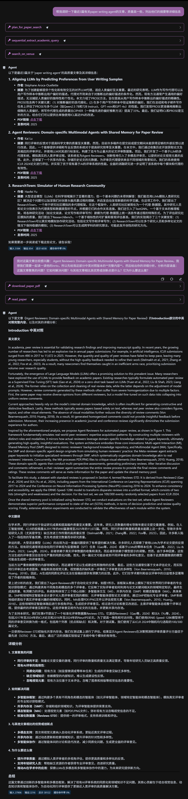
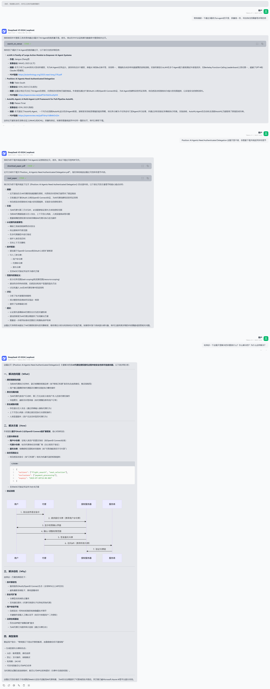
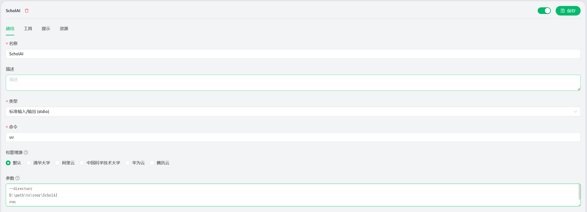
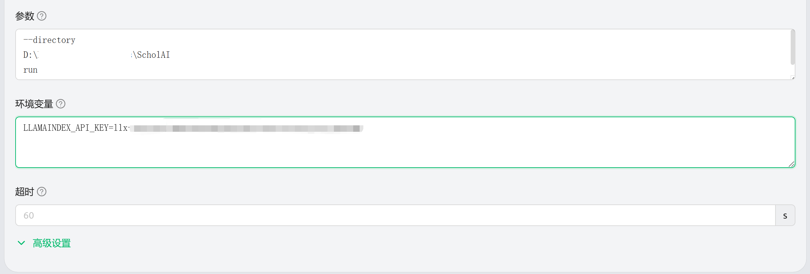

# 🎓 ScholAI

**基于MCP的智能学术研究助手 v0.0.1**

[](https://python.org)
[](https://modelcontextprotocol.io)
[](LICENSE)

[English](./README_EN.md) | 中文

## ✨ 概述

ScholAI 是一个基于模型上下文协议（MCP）的服务器，旨在增强学术研究工作流程。它提供了用于发现、分析和管理学术出版物的工具，具有 CCF 排名集成和语义查询分析等功能。





## 🆕 v0.0.1 版本更新

- **🔍 LlamaIndex API 集成** - 通过 LlamaIndex API 提供更高质量的 PDF 解析，支持表格和图表提取
- **🧠 智能搜索规划** - 新增 `plan_for_paper_search` 工具，智能规划论文搜索策略
- **🎯 查询意图分析** - 增强对用户学术查询的理解，提取核心研究意图
- **📂 文件管理优化** - 改进 PDF 文件路径处理逻辑，提高文件查找效率
- **🚀 性能提升** - 优化异步处理和 API 调用逻辑，提高响应速度

## 🚀 快速开始

### 前提条件

- Python 3.11 或更高版本
- uv 包管理器（**推荐**）或 pip

### 安装

1. **克隆仓库：**

   ```bash
   git clone https://github.com/oDaiSuno/ScholAI
   cd ScholAI
   ```

2. **安装依赖（强烈推荐使用uv）：**

   ```bash
   # 使用 uv（推荐）
   uv sync
   
   # 或使用 pip
   pip install -r requirements.txt
   
   # 如果上述方法不成功，可以手动安装缺失的依赖
   pip install httpx pyyaml beautifulsoup4 dict2xml mcp[cli] pymupdf
   ```


3. **准备数据目录：**

   ```bash
   mkdir -p data
   ```

### 配置 MCP 服务器

这里以cherry studio为例，填写名称为`ScholAI`，命令为`uv`，参数如下（记得更改项目路径）

```
--directory
D:\path\to\your\ScholAI
run
main.py
```



### 配置 LlamaIndex API（可选但推荐）

为了获得更高质量的 PDF 解析结果，可以设置`LLAMAINDEX_API_KEY`环境变量：
你可以在 [llamaindex](https://cloud.llamaindex.ai) 申请账号，并创建API Key，即可享用**每月10,000的免费额度**。



## 🍟 主要特点

- **🔍 多数据库搜索**：访问 arXiv 预印本和同行评审出版物
- **🏆 CCF 排名集成**：自动确定会议和期刊排名
- **📄 PDF 管理**：下载和提取学术论文文本
- **🧠 语义查询分析**：将自然语言研究兴趣转化为精确的学术查询
- **📊 高级 PDF 解析**：通过 LlamaIndex API 支持表格和图表提取（需配置 API 密钥）

## 🛠️ 核心工具

### 📚 搜索与发现

#### `search_on_arxiv`
在 arXiv 存储库中搜索预印本论文。

**参数：**
- `query`：搜索关键词或短语
- `num_results`：返回的最大论文数量（默认：100）
- `need_datetime_sort`：按提交日期排序（默认：False）

#### `search_on_venue`
在特定会议和期刊中搜索学术论文。

**参数：**
- `query`：搜索关键词或短语
- `num_results`：返回的最大论文数量（默认：100）
- `need_datetime_sort`：按发布日期排序（默认：True）

#### `plan_for_paper_search`
根据用户查询规划论文搜索策略。

**参数：**
- `user_query`：用户的原始查询
- `need_intent_extraction`：是否需要进行意图提取（默认：True）

### 📖 论文管理

#### `get_ccf_rank`
获取学术会议或期刊的 CCF 排名。

**参数：**
- `venue`：会议或期刊名称

#### `download_paper_pdf`
下载并本地保存 PDF 文件。

**参数：**
- `title`：用于生成文件名的论文标题
- `pdf_url`：直接 PDF 下载 URL

#### `read_paper`
从 PDF 文件中提取文本内容，支持 LlamaIndex API 增强解析。

**参数：**
- `pdf_path`：PDF 文件路径

### 🧭 研究智能

#### `sequential_extract_academic_query`
将研究兴趣转化为精确查询的渐进分析工具。

**参数：**
- `analysis_step`：当前分析内容
- `step_number`：当前步骤索引
- `total_steps`：估计的总步骤数
- `next_step_needed`：继续分析标志
- 其他概念、数据库、搜索策略等参数

#### `list_downloaded_papers`
列出数据目录中所有已下载的 PDF 文件。


### 配置

- **CCF 排名**：将 `ccfrank.yml` 放在根目录中用于会议排名
- **数据目录**：`./data/` 用于已下载的 PDF
- **LlamaIndex API**：设置环境变量 `LLAMAINDEX_API_KEY` 启用高级 PDF 解析


## 🏗️ 技术架构

### 核心依赖

- **FastMCP**：模型上下文协议服务器框架
- **httpx**：异步 HTTP 客户端用于 API 请求
- **PyMuPDF (fitz)**：PDF 处理和文本提取
- **PyYAML**：配置文件处理
- **BeautifulSoup**：HTML 解析
- **LlamaIndex API**：高级 PDF 解析和结构化提取（可选）

### 文件结构

```
ScholAI/
├── main.py              # 主 MCP 服务器实现
├── pyproject.toml       # 项目配置
├── uv.lock              # 依赖锁定文件
├── ccfrank.yml          # CCF 排名数据库
├── data/                # 已下载论文存储
└── README.md            # 文档
```

## 🪻特别鸣谢
- 论文检索网站：https://papers.cool
- MCP调试工具：https://kirigaya.cn/openmcp

---

**用 🌟 为本项目助力**

[](https://www.star-history.com/#oDaiSuno/ScholAI&Date)