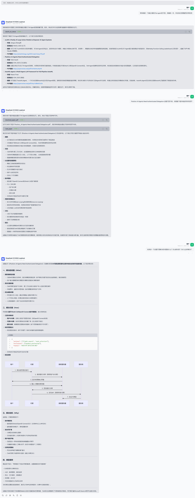
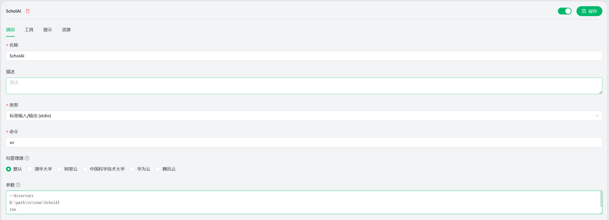

# 🎓 ScholAI

**An intelligent academic research assistant powered by MCP**

[](https://python.org)
[](https://modelcontextprotocol.io)
[](LICENSE)

English | [中文](./README.md)

## ✨ Overview

ScholAI is a Model Context Protocol (MCP) server designed to enhance academic research workflows. It provides tools for discovering, analyzing, and managing scholarly publications with features like CCF ranking integration and semantic query analysis.



## 🚀 Quick Start

### Prerequisites

- Python 3.11 or higher
- uv package manager (**recommended**) or pip

### Installation

1. **Clone the repository:**

   ```bash
   git clone https://github.com/oDaiSuno/ScholAI
   cd ScholAI
   ```

2. **Install dependencies (strongly recommend using uv):**

   ```bash
   # Using uv (recommended)
   uv sync
   
   # Or using pip
   pip install -r requirements.txt
   
   # If the above methods fail, you can manually install missing dependencies
   pip install httpx pyyaml beautifulsoup4 dict2xml mcp[cli] pymupdf
   ```

3. **Prepare data directory:**

   ```bash
   mkdir -p data
   ```

### Configuring MCP Server

Here's an example using Cherry Studio: fill in the name as `ScholAI`, command as `uv`, and parameters as follows (remember to change the project path):

```
--directory
D:\path\to\your\ScholAI
run
main.py
```



## 🍟 Key Features

- **🔍 Multi-Database Search**: Access arXiv preprints and peer-reviewed publications
- **🏆 CCF Ranking Integration**: Automatically determine conference and journal rankings
- **📄 PDF Management**: Download and extract text from academic papers
- **🧠 Semantic Query Analysis**: Transform natural language research interests into precise academic queries

## 🛠️ Core Tools

### 📚 Search & Discovery

#### `search_on_arxiv`
Search preprint papers on arXiv repository.

**Parameters:**
- `query`: Search keywords or phrase
- `num_results`: Maximum papers to return (default: 100)
- `need_datetime_sort`: Sort by submission date (default: False)

#### `search_on_venue`
Search academic papers within specific conferences and journals.

**Parameters:**
- `query`: Search keywords or phrase
- `num_results`: Maximum papers to return (default: 100)
- `need_datetime_sort`: Sort by publication date (default: True)

### 📖 Paper Management

#### `get_ccf_rank`
Get the CCF ranking of an academic venue.

**Parameters:**
- `venue`: Name of the conference or journal

#### `download_paper_pdf`
Download and save PDF files locally.

**Parameters:**
- `title`: Paper title for filename generation
- `pdf_url`: Direct PDF download URL

#### `read_paper`
Extract text content from PDF files.

**Parameters:**
- `pdf_path`: Path to PDF file

### 🧭 Research Intelligence

#### `sequential_extract_academic_query`
Progressive analysis tool for transforming research interests into precise queries.

**Parameters:**
- `analysis_step`: Current analysis content
- `step_number`: Current step index
- `total_steps`: Estimated total steps
- `next_step_needed`: Continue analysis flag
- Additional parameters for concepts, databases, search strategy, etc.

#### `list_downloaded_papers`
List all downloaded PDF files in the data directory.

### Configuration

- **CCF Rankings**: Place `ccfrank.yml` in the root directory for venue rankings
- **Data Directory**: `./data/` for downloaded PDFs

## 🏗️ Technical Architecture

### Core Dependencies

- **FastMCP**: Model Context Protocol server framework
- **httpx**: Asynchronous HTTP client for API requests
- **PyMuPDF (fitz)**: PDF processing and text extraction
- **PyYAML**: Configuration file processing
- **BeautifulSoup**: HTML parsing

### File Structure

```
ScholAI/
├── main.py              # Main MCP server implementation
├── pyproject.toml       # Project configuration
├── uv.lock              # Dependency lock file
├── ccfrank.yml          # CCF ranking database
├── data/                # Downloaded papers storage
└── README.md            # Documentation
```

---

**Star this project to show your support**

[](https://www.star-history.com/#oDaiSuno/ScholAI&Date) 